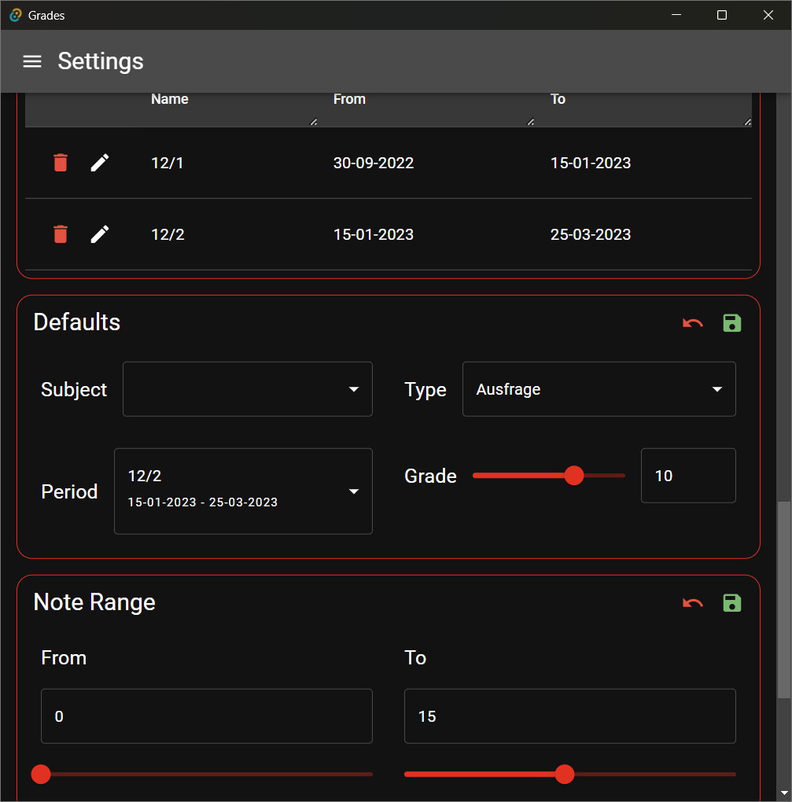
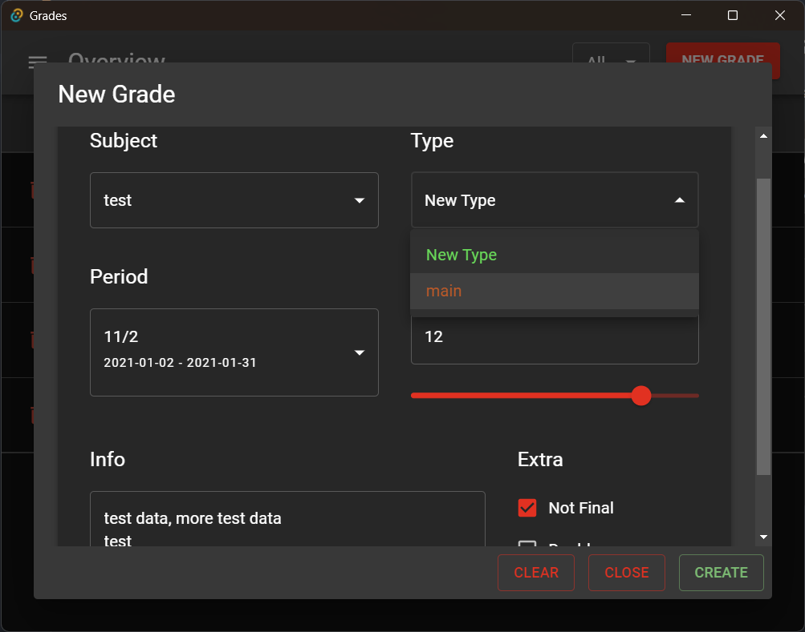
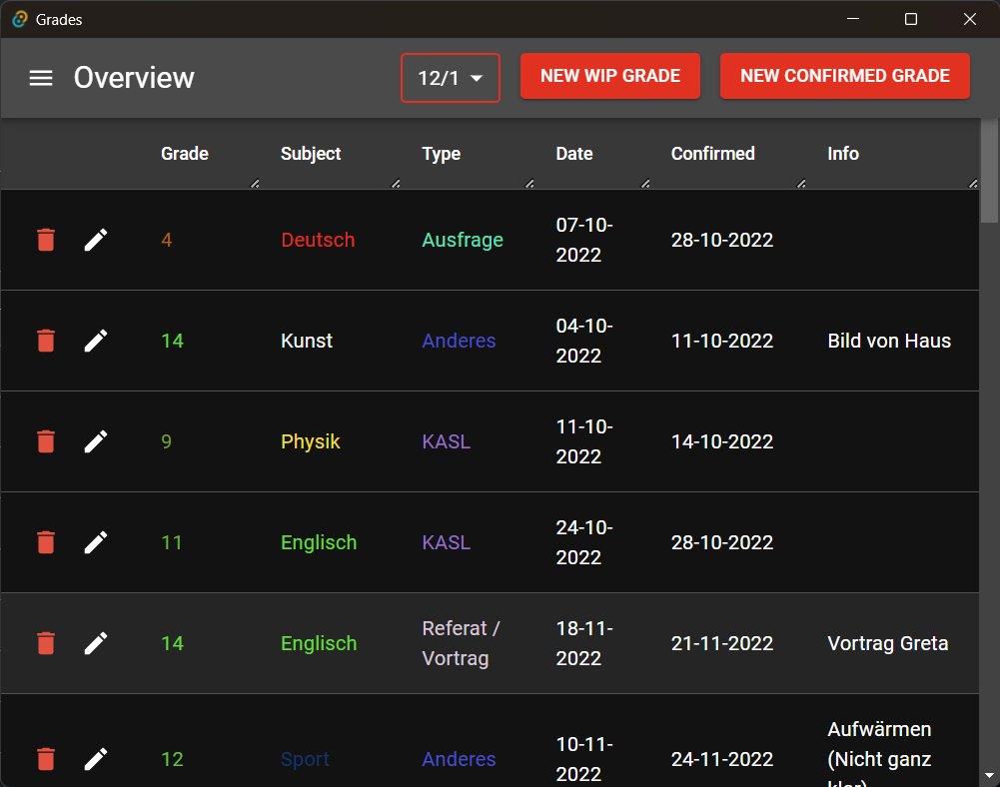
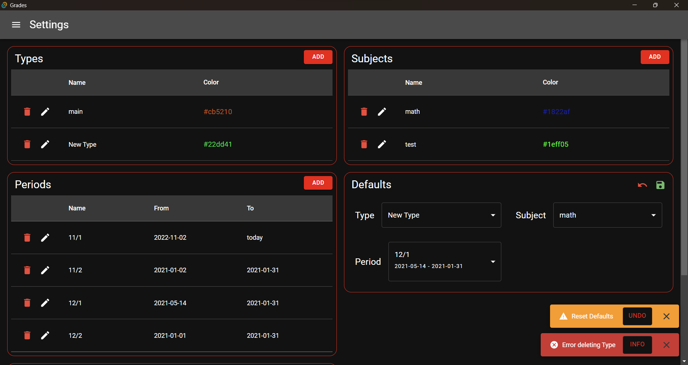

# Grades

#### A tauri desktop app to manage grades in school

Backend written in Rust, uses SeaOrm and Sqlite to store data

Frontend is written in React.js, Typescript, react-query and MUI using vite as bundler

### Overview: 

### New Grade Dialog

### Settings

