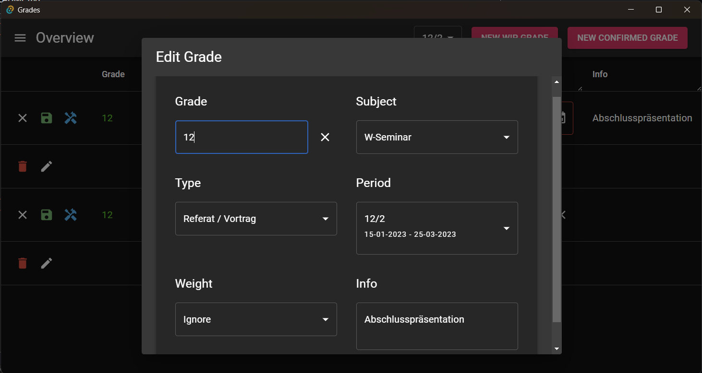
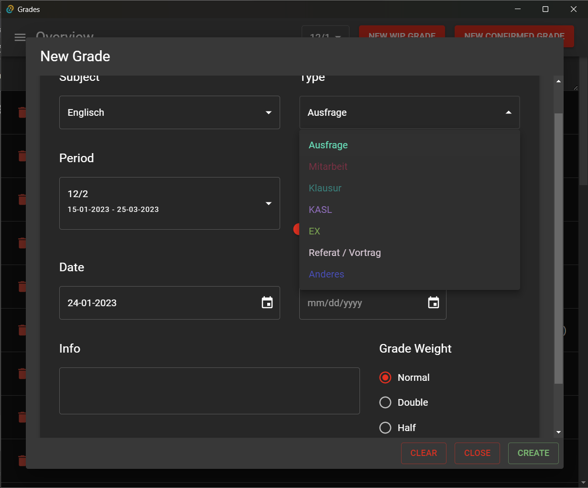

# Grades

### A tauri desktop app to manage grades in school

Backend written in Rust, using SeaOrm and Sqlite

Frontend is written in Typescript, React with MUI and react-quer, using vite

UI-Tests with vitest and testing-library

### Overview: 

### New Grade Dialog

### Settings
