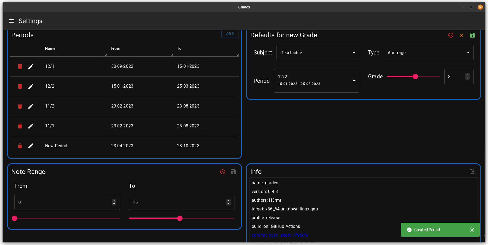

# Grades

### A tauri desktop app to manage grades in school

Backend written in Rust, using SeaOrm and Sqlite

Frontend is written in Typescript, React with MUI and react-quer, using vite

UI-Tests with vitest and testing-library

### Overview: 

### New Grade Dialog

### Analysis (beta)

### Settings

#### update Gist
https://gist.github.com/H3rmt/9f0a67b7ad425e9fb74b32f6afcab111
